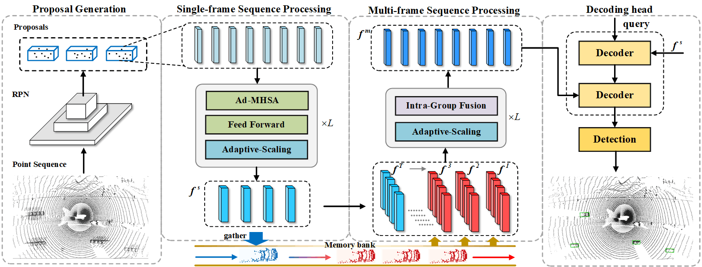

## FASTer: Focal token Acquiring-and-Scaling Transformer for Long-term 3D Objection Detection (CVPR2025) [paper](https://arxiv.org/abs/2503.01899)

**Authors**: [Chenxu Dang](https://github.com/MSunDYY), Zaipeng Duan, Pei An, Xinmin Zhang, Jie Ma.
## Introduction


Recent top-performing temporal 3D detectors based on Lidars have increasingly adopted region-based paradigms. They first generate coarse proposals, followed by encoding and fusing regional features. However, indiscriminate sampling and fusion often overlook the varying contributions of individual points and lead to exponentially increased complexity as the number of input frames grows. Moreover, arbitrary result-level concatenation limits the global information extraction. In this paper, we propose a **F**ocal Token **A**cquring-and-**S**caling **T**ransform**er** (FASTer), which dynamically selects focal tokens and condenses token sequences in an adaptive and lightweight manner. Emphasizing the contribution of individual tokens, we propose a simple but effective Adaptive Scaling mechanism to capture geometric contexts while sifting out focal points. Adaptively storing and processing only focal points in historical frames dramatically reduces the overall complexity. Furthermore, a novel Grouped Hierarchical Fusion strategy is proposed, progressively performing sequence scaling and Intra-Group Fusion operations to facilitate the exchange of global spatial and temporal information. Experiments on the Waymo Open Dataset demonstrate that our FASTer significantly outperforms other state-of-the-art detectors in both performance and efficiency while also exhibiting improved flexibility and robustness.
## Setup
This project is built on [OpenPCDet](https://github.com/open-mmlab/OpenPCDet). Please follow their instruction to construct the conda environment and compare the Waymo dataset.
## Training
The training of FASTer is similar to [MSF](https://github.com/skyhehe123/MSF.git), first train the RPN model
```shell
bash scripts/dist_train.sh ${NUM_GPUS} --cfg_file cfgs/waymo_models/centerpoint_4frames.yaml
```
The ckpt will be saved in ../output/waymo_models/centerpoint_4frames/default/ckpt.
Then Save the RPN model's prediction results of training and val dataset
```shell
# training
bash scripts/dist_test.sh ${NUM_GPUS}  --cfg_file cfgs/waymo_models/centerpoint_4frames.yaml \
--ckpt ../output/waymo_models/centerpoint_4frames/default/ckpt/checkpoint_epoch_36.pth \
--set DATA_CONFIG.DATA_SPLIT.test train
# val
bash scripts/dist_test.sh ${NUM_GPUS}  --cfg_file cfgs/waymo_models/centerpoint_4frames.yaml \
--ckpt ../output/waymo_models/centerpoint_4frames/default/ckpt/checkpoint_epoch_36.pth \
--set DATA_CONFIG.DATA_SPLIT.test val
```
The prediction results of train and val dataset will be saved in \
../output/waymo_models/centerpoint_4frames/default/eval/epoch_36/train/default/result.pkl,
../output/waymo_models/centerpoint_4frames/default/eval/epoch_36/val/default/result.pkl.

After that, train FASTer with multi-gpus:
```shell
bash scripts/dist_train.sh ${NUM_GPUS} --cfg_file cfgs/waymo_models/faster_16frames.yaml --batch_size 2 
```
or single one gpu (advised):
``` shell
python train.py --cfg_file cfgs/waymo_models/faster_16frames.yaml --batch_size 5
```
To facilitate training and reproducing, we have only released the version without EPA, which results in a performance drop (≈0.25) compared to the results reported in our paper. However, this is sufficient to demonstrate the effectiveness of FASTer.
## Evaluation
```shell
# Single GPU for online reference
python test.py --cfg_file cfgs/waymo_models/faster_16frames.yaml  --batch_size  1 \
--ckpt  ../output/waymo_models/faster_4frames/default/ckpt/checkpoint_epoch_6.pth
# We do not support multi-GPU inference for now.
```

## Acknowlegment
Our codes and inspirations are mainly from [MPPNet](https://github.com/open-mmlab/OpenPCDet/blob/master/docs/guidelines_of_approaches/mppnet.md) and [MSF](https://github.com/skyhehe123/MSF). We sincerely appreciate their contributions!

## Citation
If you recognize our work or find it inspiring, please cite our paper.

```shell
@article{dang2025faster,
  title={FASTer: Focal Token Acquiring-and-Scaling Transformer for Long-term 3D Object Detection},
  author={Dang, Chenxu and Duan, Zaipeng and An, Pei and Zhang, Xinmin and Hu, Xuzhong and Ma, Jie},
  booktitle={Proceedings of the Computer Vision and Pattern Recognition Conference},
  pages={17029--17038}
  year={2025}
}
```


